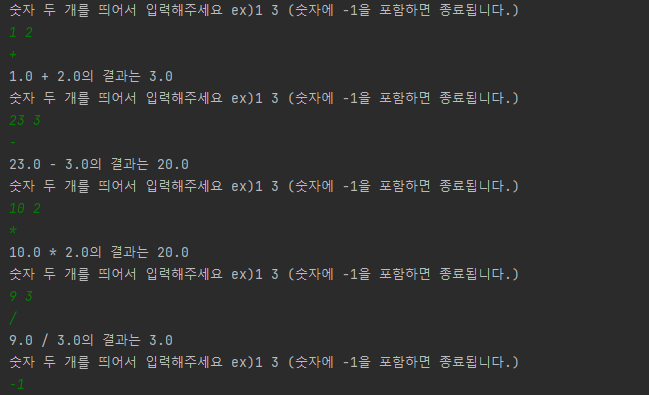
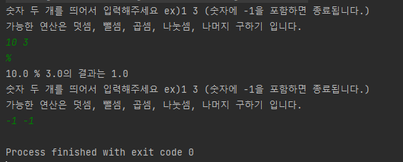

Kotlin 문법 기초 과제 - 계산기 (Lv.1 ~ LV.4)
===

## LV 1  
 - 주생성자로 숫자 두 개를 받은 후 operation 메소드로 연산자를 입력하고 계산 실행
 - 잘못 된 연산자를 입력 받을 경우 "잘못된 연산자입니다." 출력
 
캡쳐화면  

  

## LV 2  
 - **%** 연산자를 통해 나머지 연산을 구현

 Fix) 연산자를 받기 전 -1을 입력받으면 종료하도록 구현




## LV 3  
- Calculator 클래스가 모든 계산을 직접하지 않고 각 계산 클래스 모듈을 불러와서 계산하도록 변경 (책임 분배)
```kotlin
class Calculator(
    private val operand1: Double,
    private val operand2: Double
) {
    fun addOperation(addOperation: AddOperation): Double = addOperation.operate(operand1, operand2)
    fun subOperation(subOperation: SubtractOperation): Double = subOperation.operate(operand1, operand2)
    fun mulOperation(mulOperation: MultiplyOperation): Double = mulOperation.operate(operand1, operand2)
    fun divOperation(divideOperation: DivideOperation): Double = divideOperation.operate(operand1, operand2)
} 
```


## LV 4  
- Lv3에서 Calculator는 다른 4가지 operator 클래스를 직접 참조하고 있어 operator 클래스에 변화가 있으면 Calculator 클래스에도 영향을 준다.  
- 이런 operate 클래스를 구체적인 operator가 아닌 추상화된 operator클래스로 만들어 구체적인 operate가 추상적인 operate에 의존하게 한다.  
- 이제 Calculator가 구체적인 operator를 의존하지 않고 추상화된 operator에만 의존하게 되어 operator를 바꿔도 Calculator에는 영향을 주지 않는다.  
- 객체지향의 5대 원칙 중 DIP - 의존성 역전 원칙이라 한다.  